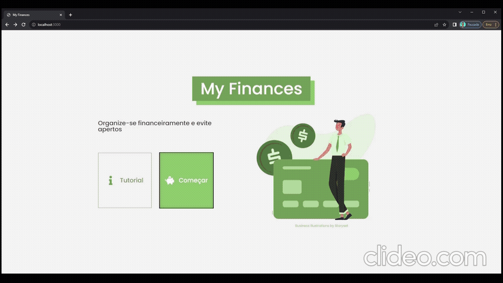

<div style="text-align: center;">
  
</div>

[PT](#pt-br) - <a href="#pt-br" title="English is not available yet" disable style="cursor: default; color: gray;">EN</a>

#### PT-BR
O My Finances é um site para controle de finanças pessoais open source e com objetivo de ser de fácil utilização e bem otimizado.

📌 Tabela de conteúdos
=
  * [Descrição](#)
  * [📌 Tabela de conteúdos](#📌-tabela-de-conteúdos)
  * [🔌 Instalação](#🔌-instalação)
  * [⌨ Como usar](#⌨-como-usar)
  * [🚧 Status](#🚧-status)
    * [✨ Features](#✨-features)
  * [📃 Licença](#📃-licença)
  * [🛠 Tecnologias utilizadas](#🛠-tecnologias-utilizadas)
    * [🔧 Bibliotecas populares utilizadas](#🔧-bibliotecas-populares-utilizadas)
  * [💻 Para devs](#💻-para-devs)


## 🔌 Instalação

Você precisa do [Git](https://git-scm.com) e do [Node.JS](https://nodejs.org/) instalados na sua máquina (recomendo Node >=18.0.0).

```bash
# Clone este repositório
$ git clone <https://github.com/JoaoSCoelho/my-finances-frontend>

# Acesse a pasta do projeto no terminal/cmd
$ cd my-finances-frontend

# Instale as dependências
$ npm install
```

## ⌨ Como usar

<p style="background-color: #ff450030; padding: 1em; font-style: italic; font-weight: bold;">❗❕ Antes de iniciar o site, você precisa iniciar o servidor, para isso clone o repositório <a style="font-style: initial;" href="https://github.com/JoaoSCoelho/my-finances-backend"><code>&lt;https://github.com/JoaoSCoelho/my-finances-backend&gt;</code></a> e siga os passos para inicialização.</p>


```bash
# Execute a aplicação em modo de desenvolvimento
$ npm run dev
# ou em modo de produção
$ npm run build
$ npm run start

# O site iniciará na porta:3000 - acesse <http://localhost:3000>
```
o site irá rodar por padrão em `localhost:3000`, para visualizar abra [`http://localhost:3000`](http://localhost:3000) no seu navegador.



## 🚧 Status
> **🚧 Em construção... 🚧 v1.0.1**

### ✨ Features

- [x] Cadastro de usuário
- [x] Cadastro, edição e remoção de contas bancárias
- [x] Cadastro, edição e remoção de transações (Receitas, Despesas e Transferências)

## 📃 Licença

[MIT](https://choosealicense.com/licenses/mit/)

## 🛠 Tecnologias utilizadas


React | Next.JS | TypeScript

### 🔧 Bibliotecas populares utilizadas


SWR | Axios | React Hook Form | Yup | React Icons | React Loading Skeleton | Day.JS

## 💻 Para devs
Para mais detalhes do código do projeto, estrutura de pastas, componentes produzidos, entre outras coisas: entre no arquivo [code-details.md](code-details.md).
