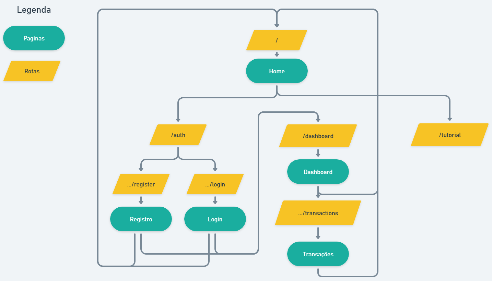

# Documentação do código

[PT](#pt-br) - <a href="#pt-br" disable style="cursor: default; color: gray;">EN</a>

#### PT-BR

Tabela de conteúdos
=
  * [Tabela de conteúdos](#tabela-de-conteúdos)
  * [Mapa de navegação](#mapa-de-navegação)
  * [Mapa de arquivos](#mapa-de-arquivos)
  * [Hooks úteis](#hooks-úteis)
    * [useDebouce](#→-usedebounce)
    * [useSWR](#→-useswr)
    * [useMy, useMyBankAccounts e useMyTransactions](#→-useme-usemybankaccounts-e-usemytransactions)


## Mapa de navegação


## Mapa de arquivos


## Hooks úteis

### → [useDebounce](src/hooks/useDebounce.ts)

Esse hook serve para criar um "delay" entre o momento em que a função `debounce` é chamada e o momento em que a função `func` é executada.
Diferente de um `setTimout` pois ao ser chamado novamente a função `debounce`, a contagem do tempo reinicia.

Exemplo de uso:


<p style="font-size: 0.8em">Neste exemplo, vemos que o useDebouce faz com que a atualização do card embaixo do modal só seja feita quanto o usuário pare de digitar, evitando desperdício de recursos da máquina.</p>

### → [useSWR](src/hooks/useSWR.ts)

Esse hook é uma alternativa pré configurada do hook `useSWR` oriundo da lib `swr`, ele faz a mesma coisa que o `useSWR` original, mas com algumas configurações pré definidas e com três funções extras de retorno: `revalidate()`, `refetch()` e `offMutate()`.

→ Geralmente é utilizado em outros [hooks de controle de dados específicos](#→-useme-usemybankaccounts-e-usemytransactions).

Exemplo de uso:

```ts
const {
  data,
  mutate,
  offMutate,
  error, // Se ocorrer um erro na função fetcher, ele é setado aqui
  isValidating, // Se a promise da função fetcher estiver pendente
  isLoading, // Se `data === undefined` e `isValidating === true`
  refetch,
  revalidate
} = useSWR('transactions', fetcher);

// Função que faz o fetch dos dados no backend
async function fetcher() {
  return await api
    .get('transactions', axiosConfig)
    .then(({ data: { transactions } }) => transactions)
    .catch((reason) => {
      throw { ...reason, ...reason.response?.data };
    });
  }

console.log(data) // output:
// [
//   {
//     id: "202307031337360216359",
//     bankAccountId: "202307032313477496864",
//     spent: 15.45,
//     createdTimestamp: 1688426027749,
//     title: "Despesa",
//     type: "expense"
//   },
//   {
//     id: "202307032244492933982",
//     giverBankAccountId: "202307031337360216359",
//     receiverBankAccountId: "202307031313468029045",
//     amount: 550,
//     description: "Transferência entre bancos",
//     createdTimestamp: 1688424289293,
//     title: "título da transferência",
//     type: 'transfer'
//   },
//   ...
// ]

mutate([]) // Vai setar `[]` como valor de `data` e vai invocar a função `fetcher()` para que revalide os dados
offMutate([]) // Vai setar `[]` como valor de `data` e NÃO vai invocar a função `fetcher()`
refetch() // Vai setar `data = undefined` e vai invocar `fetcher()`
revalidate() // Vai manter o `data` atual e vai incovar `fetcher()`
```

### → [useMe](src/hooks/useMe.ts), [useMyBankAccounts](src/hooks/useMyBankAccounts.ts) e [useMyTransactions](src/hooks/useMyTransactions.ts)

Esses hooks são hooks de controle de dados específicos, ou seja, eles são basicamente a mesma coisa do [hook useSWR](#→-useswr), mas com o `key`, `fetcher` e `config` pré-definidos para um certo tipo de dado.

Exemplo:
```tsx
export default function Profile() {
  const {
    user, // Mesma coisa do `data`
    error,
  } = useMe();

  if (error) alert('Erro inesperado ao buscar seus dados!')

  if (!user) return <></>;

  return (
    <div className={styles.profile}>

      <div className={styles.profileImage}>
        <Image
          src={user.profileImageURL || DEFAULT_USER}
          alt={`Imagem de perfil de ${user.username}`}
          width={50}
          height={50}
        />
      </div>

      <div className={styles.username}>{user.username}</div>
    </div>
  );
}
```

## Fazendo requisições na API

<p style="background-color: #ff450020; padding: 1em; font-style: italic; font-weight: bold;">
→ Use SEMPRE a <code>AxiosInstance</code> <code>api</code> exportada de <a href="src/services/api.ts"><code>src/services/api.ts</code></a>, pois além de já ter a URL do servidor pré-setada, tem um <code><a href="src/contexts/auth.tsx">interceptor</a></code> para autenticação que faz refresh do <code>accessToken</code> sempre que ele está expirado.
</p>

Se a requisição é do tipo `GET`, veja a possibilidade de criar um novo [hook de controle de dados específicos](#→-useme-usemybankaccounts-e-usemytransactions).

Se a requisição for para um endpoint que precise de autenticação do usuário, talvez seja legal usar as funções `getAuthConfig()` ou `getAccessToken()` do contexto `AuthContext` para pegar os dados de autenticação do usuário.

Exemplo:
```ts
const {
  getAuthConfig, // `getAuthConfig()` retorna: `{ headers: { Authorization: "Bearer {ACCESS_TOKEN}" } }`
  getAccessToken, // `getAccessToken()` retorna `ACCESS_TOKEN`
} = useContext(AuthContext);

function onSubmit(data: Data) {
  // Você pode usar `getAuthConfig()` se não precisar passar nenhuma outra configuração para a requisição
  api
    .post('api-endpoint', data, getAuthConfig())
    .then((response) => {//     ^^^^^^^^^^^^^
      // on successfully
    })
    .catch((error) => {
      // on error
    });

  // ou você pode usar `getAccessToken()` para obter apenas o token de acesso
  api
    .post('api-other-endpoint', data, { headers: { Authorization: `Bearer ${getAccessToken()}` } })
    .then((response) => {//                                                 ^^^^^^^^^^^^^^
      // on successfully
    })
    .catch((error) => {
      // on error
    });
}
```
